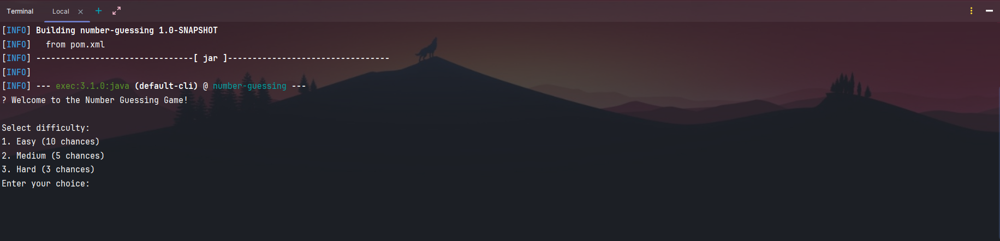

# Number Guessing Game

Build a simple number guessing game to test your luck.

Project
URL: <a href="https://roadmap.sh/projects/number-guessing-game">https://roadmap.sh/projects/number-guessing-game</a>

## Run application

Open terminal and type these following commands to run application

##### 1. Clone repository and change to project directory

```shell
git clone https://github.com/roadmap-dot-sh/number-guessing.git
cd number-guessing
```

##### 2. Start application

```shell
mvn compile
mvn exec:java
```

App run in terminal like that:

